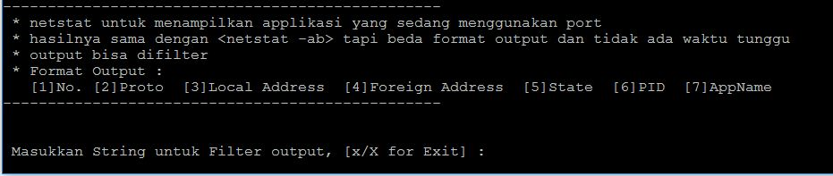
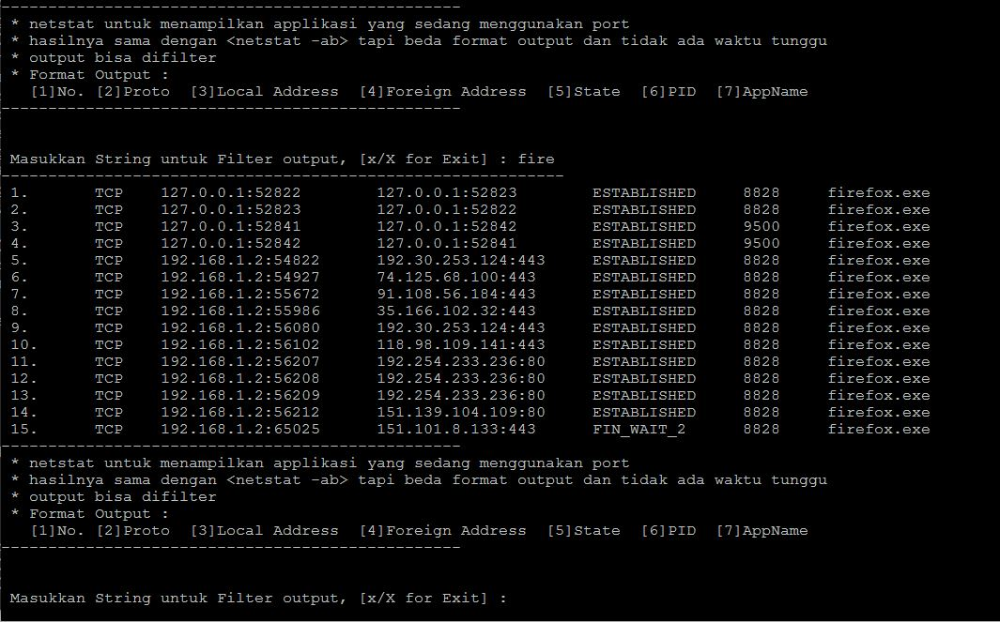

## TENTANG TOOL INI 
Tool/Script ini adlah tool untuk melihat aktifitas koneksi dan port yang terbuka menggunakan netstat 
yang dieksekusi menggunakan python untuk mendapatkan format output yang sesuai dengan keinginan, 
dilengkapi dengan filter yang lebih memudahkan

## KETERANGAN FILE dan HOW TO 
Terdapat dua file `.py` : 
	1. `getappname.py` untuk menampilkan aktifitas koneksi dan port yang digunakan, 
		HOW TO : 
		tulis perintah di terminal/CMD : `python getappname.py` lalu ENTER
		
		langsung tekan ENTER untuk menampilkan semua atau tulis string untuk filter output
		berikut contoh hasil screenshot menggunakan filter : 
		
	2. `getappname-table-output.py` untuk menampilkan aktifitas koneksi dan port yang digunakan dengan output dalam format tabel,
		HOW TO :
		pertama, install dulu module `terminaltables` dengan perintah : `pip install terminaltables`
		setelah itu perintah sama dengan perintah pada `getappname.py`
## CONTOH OUTPUT 
	1. Contoh kesatu : 
	![Tampilah satu](img_exp/exp0.JPG "Tampilan satu"
	2. Contoh kedua : 
	![Tampilah dua](img_exp/exp1.JPG "Tampilan dua"
	3. Contoh ketiga : 
	![Tampilah tiga](img_exp/exp2.JPG "Tampilan tiga"